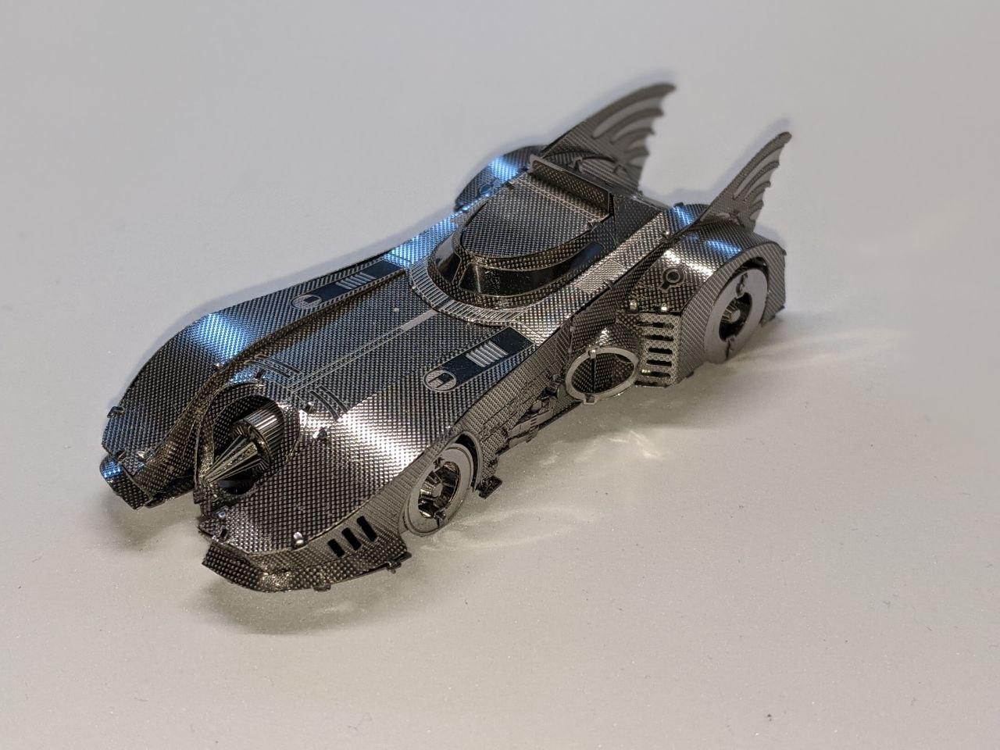
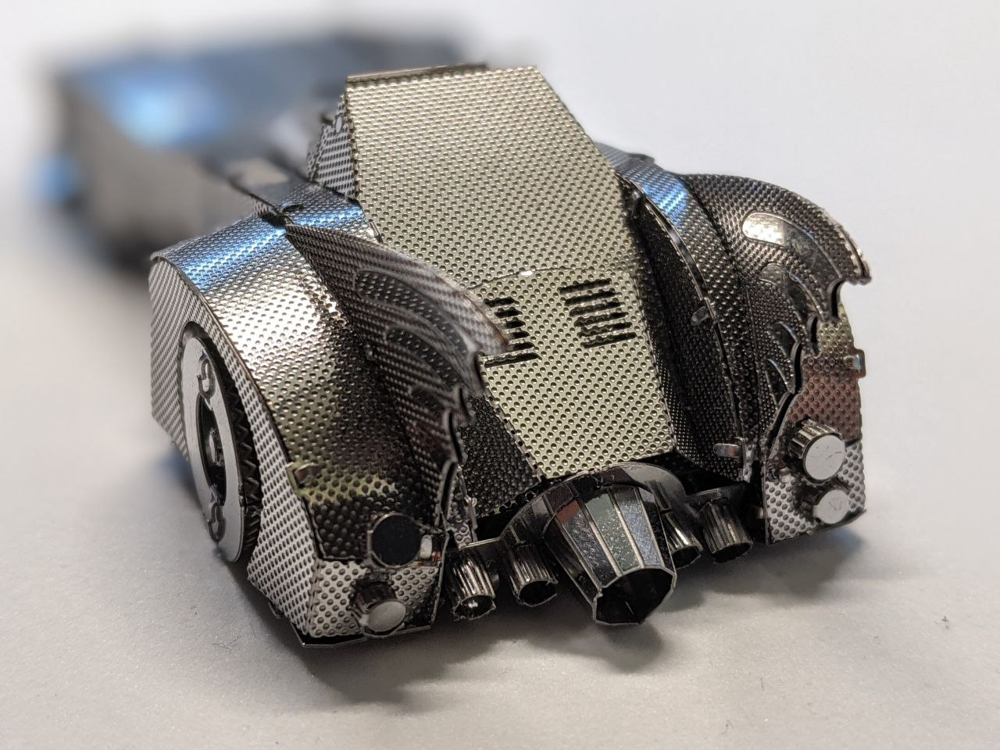
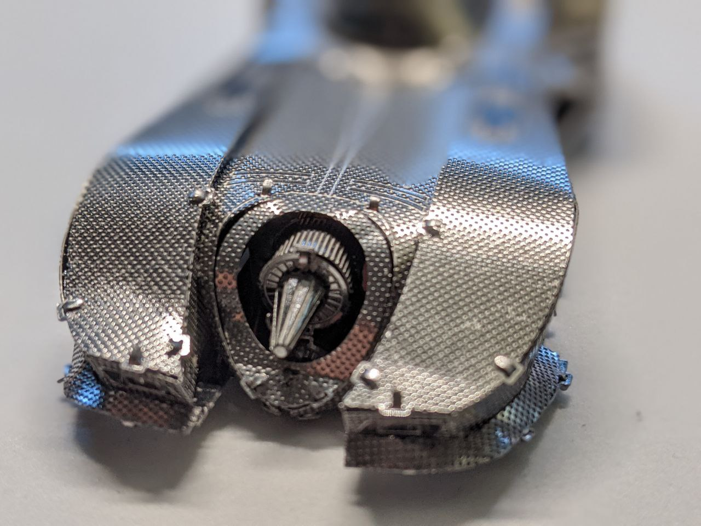
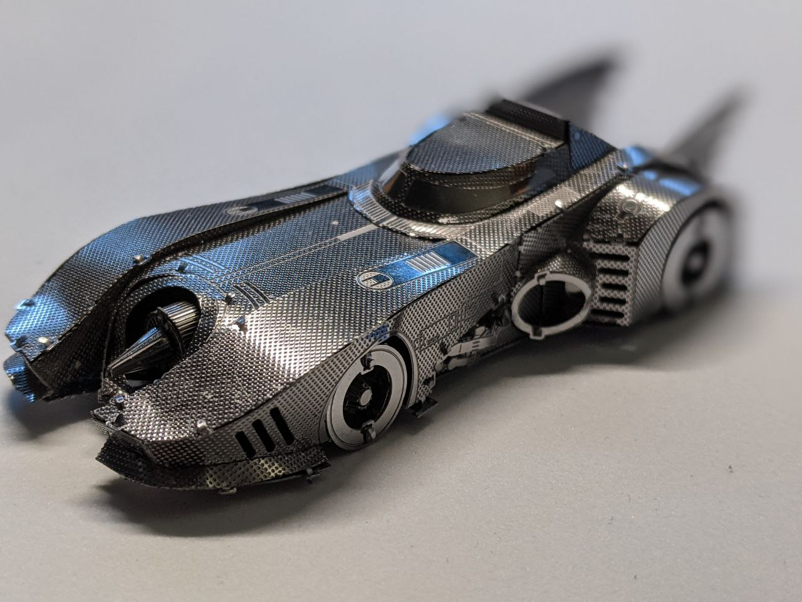
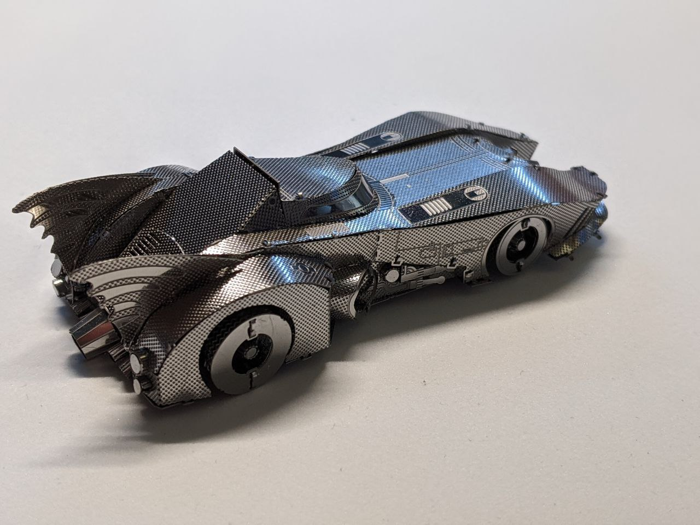
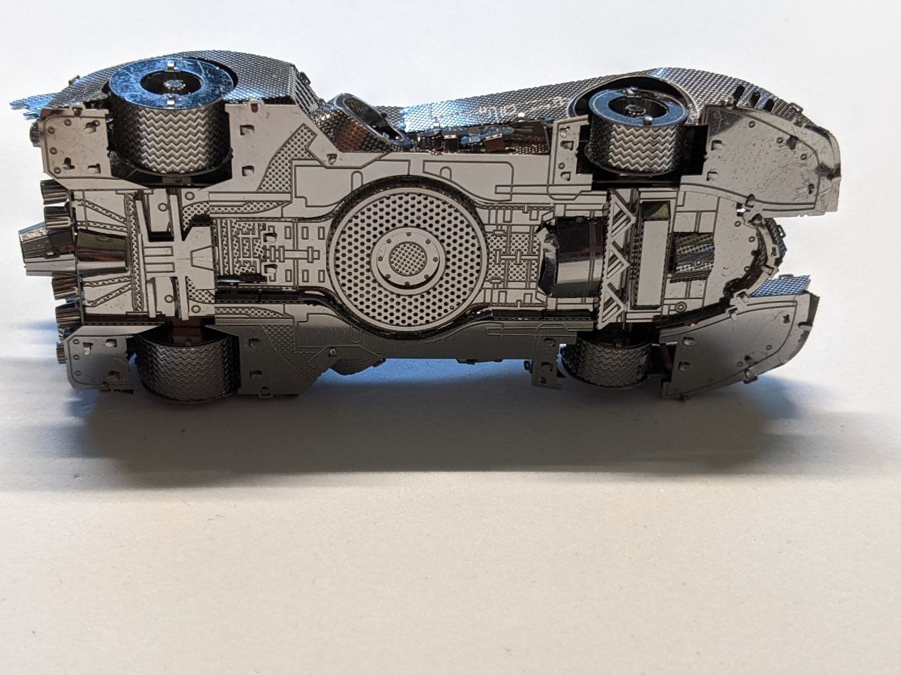

# Batmobile: Batman movie (1989)

The batmobile from the Keaton movie is one of my favorites. The model itself was quite fun to build. I love how detailed the bottom is, and the details in the engine intake at the front. The glossy finish adds a nice touch.

As with the previous model, one of the challenges was to get the bodywork curvature right, which took me many attempts even when using online pictures as a guide. It may be hard to appreciate in the picture, but every single piece of the bodywork has some curvature on it. This adds the challenge of trying to keep both sides symmetrical!

I bought special tools for this model to help with the curved and cylindrical parts. There are small metal rods of different calibers that end in a cone, which is super useful to model small cylinders. I'll write a post shortly with the tools I use for more info.

[Official model](https://www.metalearth.com/batman/batman-movie-batmobile)

